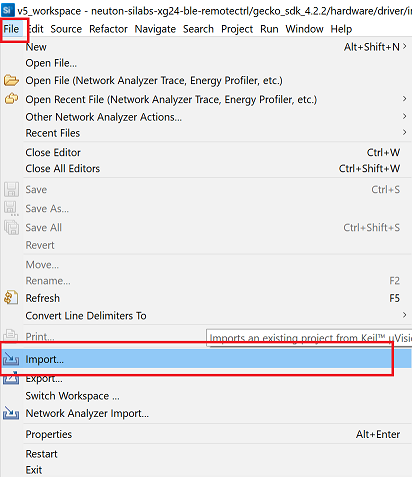

# Neuton.AI xG24 Gesture Based BLE Remote Control Device

- [Overview](#overview)
- [Model specifications](#model-spec)
- [Hardware overview](#hw-overview)
- [Setup software environment](#setup-sw-env)
- [Setup firmware project](#setup-fw-proj)
- [How the project works](#how-works)


## Overview <div id='overview'/>

This project demonstrates a gesture based remote control device using __Silabs xG24 Dev Kit__. The xG24 development kit could be connected to the PC via Bluetooth as a HID device and using gestures the user can control media stream or slides of the presentation. Based on accelerometer and gyroscope data the Neuton.AI model could recognize __8 classes__ of gestures: Swipe Right, Swipe Left, Double Tap, Double Thumb, Rotation Clockwise and Counter clockwise, No Gestures(IDLE) and Unknown Gesture.


|                                       |                                        |                                               |
| ------------------------------------- | -------------------------------------- | --------------------------------------------- |
|  |  |  |
| Double Tap                            | Swipe Right                            |    Rotation Clockwise                         |
||   |  |
| Double Thumb                          | Swipe Left                             |      Rotation Counter-clockwise               |

To learn more about gestures and how to reproduce them, check out our demo video!

[](https://www.youtube.com/watch?v=8fx7K4ZHqIU)

## Model specifications <div id='model-spec'/>

The Neuton.AI Gesture Recognition solution memory footprint:

|                       |    FLASH       |   SRAM      |
| --------------------- | -------------- | ----------- |
| __Total Footprint__   | __4.2 kB__     | __1.4 kB__  |
| Signal Processing     | 1.8 kB         | 0.219 kB    |
| Inference Engine      | 1.0 kB         |   1.2 kB    |
| Model                 | 1.4 kB         | 0 kB        |

Model Perfomance:
+ 8 classes.
+ 58 neurons.
+ Holdout Balanced Accuracy: __98.2 %__.
+ Inference time ( __including__ Signal processing ): __2.3 ms__.

*Estimated on Cortex-M33, 39MHz, compiled with -Os ARM GNU toolchain.*

## Hardware overview <div id='hw-overview'/>


The xG24 Dev Kit is a compact, feature-packed development platform. The development platform supports up to +10dBm output power and includes support for the 20-bit ADC as well as other key features such as the xG24’s AI/ML hardware accelerator. You can find more information on the Silicon Labs xG24 Dev Kit at https://www.silabs.com/development-tools/wireless/efr32xg24-dev-kit

# Setup software environment <div id='setup-sw-env'/>

To set this project up, you will need to install the following software:
1. [Simplicity Studio 5](https://www.silabs.com/developers/simplicity-studio)
2. [Gecko SDK v4.2.2](https://github.com/SiliconLabs/gecko_sdk)

# Setup firmware project <div id='setup-fw-proj'/>

1. Clone this repository: https://github.com/Neuton-tinyML/neuton-silabs-xg24-ble-remotecontrol
2. In the Simplicity Studio, choose `File -> Import`



3. Browse to the directory `./neuton-silabs-xg24-ble-remotectrl` in the cloned repository and select `neuton-silabs-xg24-ble-remotectrl` project, and click `Next`


4. On the next page the Build configuration should be automatically detected, just click `Next`.


5. Finish importing at the next page, click `Finish`.


6. Build the project in the Simplicity Studio, right-click on project folder in `Project Explorer` and choose `Build Project` option.


7. Connect xG24 Dev Kit to the PC via Micro-USB cable.

8. Wait for the end of the compilation process and flash the device, right-click on project folder in `Project Explorer` and choose `Debug As -> Silicon Labs ARM Program`.


9. Explore the project and Neuton.AI model capabilities!

# How the project works <div id='how-works'/>

The project has device logs and you can open the Serial Port to see them. The Serial Port(USART) has the following configuration:

```
Baudrate:       115200
Data:           8-bit
Parity:         none
Stop bits:      1-bit
Flow control:   none
```
Once the device is up and running, Bluetooth advertising starts as a HID device and waits for  connection request from the PC. In the device logs you should see similar messages:

```
[I] Bluetooth stack booted: v5.1.0-b144

[I] Bluetooth public device address: E0:79:8D:C6:A2:B9

[I] Started advertising
```

You can connect devices in the same way as, for example, a regular Bluetooth keyboard.

1. For Windows 10 PC you can go to `Settings -> Bluetooth & other devices -> Add Bluetooth or other device`.


2. The device should appear in `Add a device` window, choose the device for pairing.


3. After Bluetooth pairing the device should appear in your `Mouse, keyboard, & pen` section


When device is successfully paired via Bluetooth, you should see the following device logs in the Serial port:

```
[I] Connection opened.

0x020600A0

0x040600A0

[I] Characteristic was attempted changed: 3

[I] Characteristic was attempted changed: 18

[I] Notification enabled.
```

And the will change the LED indication. The `LED0` starts blinking ~5 times per second (__5 Hz__) instead 1 time per second (__1 Hz__). 

The main functionality of the project is to collect inertial sensor data from the 6-axis IMU sensor and recognize gestures on the device using Neuton.AI model and SDK. The IMU sensor data is collected with __100 Hz__ of sampling frequency. 

The recognized gestures will be printed to the Serial port and sent via Bluetooth as a specific keyboard key.

```
[I] Predicted class: SWIPE RIGHT, with probability 0.998
[I] BLE Key report was sent
```

The project has two Keyboard control modes: __Presentation Control__ and __Music Control__. 
Depending on the control mode, recognized gestures will be mapped to different keyboard keys:

__Gestures to Keyboard Keys Mapping__

|        |   Presentation Control            | Music Control     |
| ----------------------------- | ---------- | ----------------- |
| Double Tap                    | F5         | Media Play/Pause  |
| Double Thumb                  | ESCAPE     | Media Mute        | 
| Swipe Right                   | Arrow Right| Media Next        | 
| Swipe Left                    | Arrow Left | Media Previous    | 
| Rotation Clockwise            | Not used   | Media Volume Up   | 
| Rotation Counter clockwise    | Not used   | Media Volume Down |  


You can switch between control modes by pushing user button `BTN0`, for different control modes there is a different LED indication. If the device in __Presentation Control__ mode the `LED0` will blink RED color, if the device in __Music Control__ mode the `LED0` will blink GREEN color.

|    Presentation Control LED indication     |   Music Control LED indication      |
| -------------- | ----------- |
|       |  |

Enjoy exploring the project!